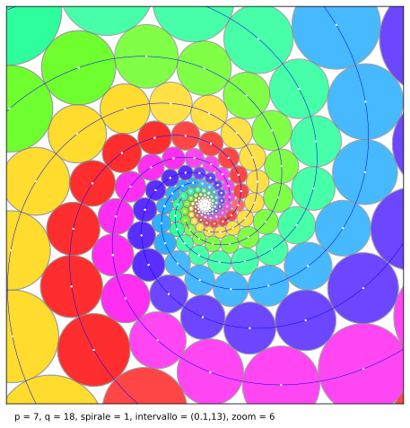
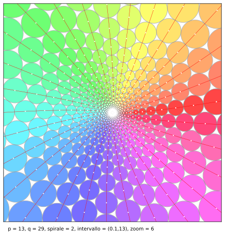

# Le spirali di Doyle

## Sperimentare con script Python

  
  

Riportiamo in questa pagina due script Python che integrano 

* le pagine sulle spirali di Doyle riportate nel sito personale  [https://www.lorenzoroi.net](https://www.lorenzoroi.net/geometriaEuclidea.html),  
* la loro versione cartacea pubblicata in [Amazon](https://amzn.eu/d/9je88dF) e 
* e la più sintetica pagina a carattere visuale [articolo](https://www.lorenzoroi.net/doyle). 

Entrambi gli script permettono la sperimentazione e si differenziano solo nell'istruzione finale: il primo visualizza la configurazione scelta in una finestra grafica, mentre il secondo la salva nella cartella corrente come file SVG.

## Files

I nomi dei file sono:

* il primo script Python  [doyle_display.py](doyle_display.py),
* il secondo  [doyle_savefile.py](doyle_savefile.py),.

## Esecuzione

Nel caso si intenda eseguire la sperimentazione online, lanciare *Binder* con i tasti sottostanti e quindi, dopo che il server remoto ha avviato 

Nel caso dello script

 

selezionare una console con *`New Launcher`* e quindi *`Other`* (oppure, da menu, *`File/New/Terminal`*) e avviarlo con il kernel *`python coordinateSolari.py`*.

*[Lorenzo Roi](mailto:LRoi@mclink.it)*
